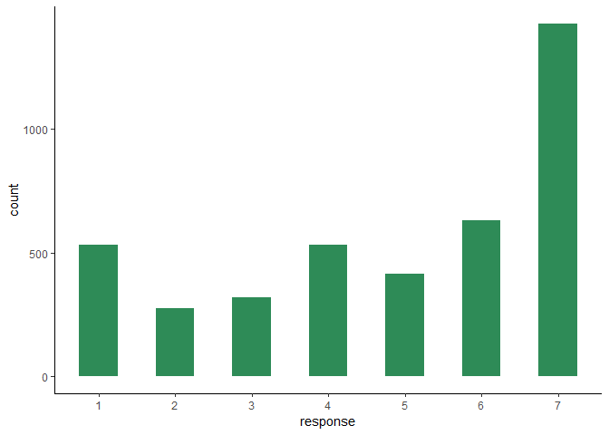
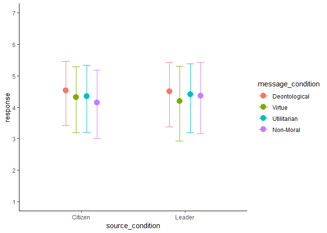
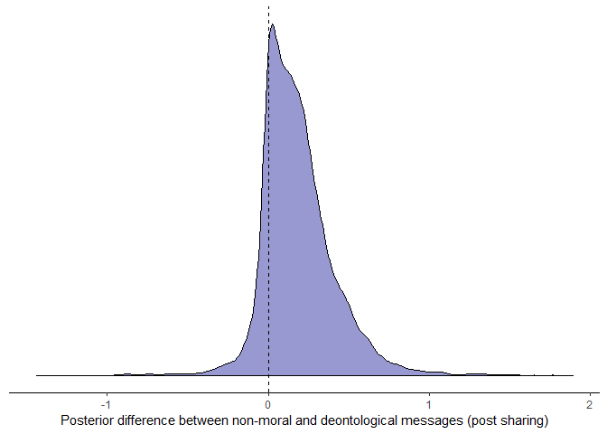
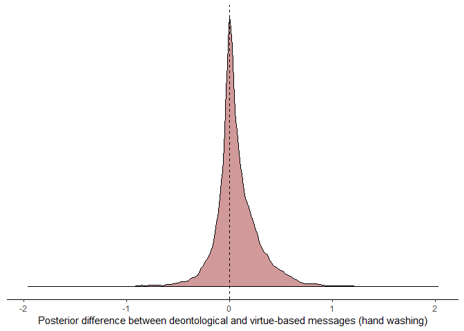

Recently, Everett *et al.* published a
[pre-print](https://psyarxiv.com/9yqs8) studying the effects of
different moral messages on US participants' intentions to engage in
protective-behaviour relating to COVID-19.

<!--html_preserve-->

<!--/html_preserve-->
With many countries around the world transitioning into full-lockdown
status, this work is timely. It is also a testament to the power of open
science: important scientific ideas can be disseminated quickly and
efficiently. As of 27th March 2020, the pre-print has been downloaded
832 times (since 21st March 2020).

Another advantage of open science is that it immediately allows other
researchers access to raw data to conduct alternative analyses. I report
such an alternative analysis here. This alternative analysis builds on
the previous work in a number of ways:

-   *I treat the outcome variable as ordinal.* This is crucial because
    treating ordinal variables as continuous, as Everett *et al.* did,
    can [distort effect size estimates](https://psyarxiv.com/x8swp/). As
    the effect sizes are small in the original pre-print, it is
    important to see whether the effects hold when using ordinal
    regression. This technique is also preferred to standard regression
    when there are ceiling or floor effects, as there are in this
    dataset.
-   *I model participants and questions as random effects.* In order to
    generalise beyond this specific sample and the specific questions
    asked in the study, we need to follow a [random effects
    approach](https://psyarxiv.com/jqw35). This approach can also easily
    scale up to multi-country studies, as it allows us to nest
    individuals within countries: this is the [next
    step](https://twitter.com/mollycrockett/status/1241038972895272968)
    for the research team.

But first, let's load the dataset in long-form.

    # can access original data here: https://osf.io/f74sz/
    d <- readd(d)
    d %>% 
      select(ID, message_condition, source_condition, behaviour, response) %>% 
      head(n = 20)

    ## # A tibble: 20 x 5
    ##       ID message_condition source_condition behaviour             response
    ##    <int> <fct>             <fct>            <chr>                    <int>
    ##  1     1 Utilitarian       Leader           self_wash_hands              7
    ##  2     1 Utilitarian       Leader           self_avoid_gatherings        7
    ##  3     1 Utilitarian       Leader           self_isolate                 4
    ##  4     1 Utilitarian       Leader           self_share_post              5
    ##  5     2 Non-Moral         Citizen          self_wash_hands              6
    ##  6     2 Non-Moral         Citizen          self_avoid_gatherings        7
    ##  7     2 Non-Moral         Citizen          self_isolate                 7
    ##  8     2 Non-Moral         Citizen          self_share_post              1
    ##  9     3 Deontological     Leader           self_wash_hands              5
    ## 10     3 Deontological     Leader           self_avoid_gatherings        5
    ## 11     3 Deontological     Leader           self_isolate                 3
    ## 12     3 Deontological     Leader           self_share_post              1
    ## 13     4 Virtue            Citizen          self_wash_hands              7
    ## 14     4 Virtue            Citizen          self_avoid_gatherings        5
    ## 15     4 Virtue            Citizen          self_isolate                 3
    ## 16     4 Virtue            Citizen          self_share_post              6
    ## 17     5 Utilitarian       Leader           self_wash_hands              6
    ## 18     5 Utilitarian       Leader           self_avoid_gatherings        6
    ## 19     5 Utilitarian       Leader           self_isolate                 4
    ## 20     5 Utilitarian       Leader           self_share_post              6

In particular, we're interested in the `response` column.

This is accumulated Likert-scale responses to four "behavioural
intentions" questions after reading a social-media post with a
particular moral message. The behavioural intentions questions are (1)
washing hands, (2) avoiding public gatherings, (3) staying at home, and
(4) sharing the social-media post. I have accumulated these responses
into a single `response` column, as we can then model all the
behavioural intentions questions at once, treating the different
questions as random effects. As you can see from the histogram, the
modal choice is 7 (extremely likely to act). This ceiling effect makes
an ordinal approach to these data necessary.

I focus on behavioural intentions for this analysis. In a
between-subjects experiment, the original pre-print manipulated two
variables. First, the source of the message was manipulated (from a
citizen, or from a leader). Second, the type of message was manipulated
(non-moral, deontological, virtue, utilitarian). The research aims to
uncover whether responses differ in these different conditions.

I fitted five Bayesian ordinal multilevel models to these data using the
[*brms* package](https://github.com/paul-buerkner/brms):

-   `m1` - Null model
-   `m2` - Main effect of source condition
-   `m3` - Main effect of message condition
-   `m4` - Interaction between source and message condition
-   `m5` - Interaction between source and message condition (with
    controls)

These models include `response` as the ordinal DV, participant `ID`
(1-1032) as a random intercept, and also `behaviour` (1-4) as another
random intercept. Main effects and interactions for source and message
are also included as random slopes within `behaviour`, meaning that each
behaviour has its own effect of source and message.

Before digging into the models, what does model comparison tell us? We
use leave-one-out cross-validation to compare models.

    # only m1-m4, m5 has fewer data points due to listwise deletion
    loo_compare(m1, m2, m3, m4)

    ##    elpd_diff se_diff
    ## m2  0.0       0.0   
    ## m1 -0.5       3.0   
    ## m3 -1.9       4.0   
    ## m4 -2.2       3.8

None of the models differ from the null model, suggesting that the
source or the moral framing of the message do not affect people's
responses to questions about their behavioural intentions.

Let's visualise the predictions of the interaction model `m4` to see
this for ourselves.

The above plot lumps the four behavioural intentions together. However,
one key finding from the original pre-print is that participants
"reported significantly stronger intentions to share the deontological
message" compared to the control condition. Let's visualise the
posterior difference between non-moral and deontological messages for
the post-sharing question specifically.

85% of the posterior distribution is above zero, which is not enough to
claim that deontological messages encourage greater post-sharing over
non-moral messages. This finding remains when including demographics
controls (not shown here).

Another finding from the paper is that, when including demographic
controls, "deontological messages were more effective than virtue-based
messages" at encouraging hand washing. We follow the same approach above
to evaluate this claim.

63% of the posterior distribution is above zero, which again is not
enough to claim that deontological messages encourage greater
hand-washing over virtue-based messages.

However, we do replicate the demographic effects from the original
paper. Model `m5` reveals that US participants who are younger, male,
white, *more* educated, more conservative, and less religious are the
ones that are less likely to engage in protective behaviours (not shown
here).

In sum, while I applaud the speedy efforts of Everett *et al.* to
publish their pre-print on this important topic so quickly,
unfortunately I do not think the data, when properly modelled, supports
the conclusion that "focusing on duties and responsibilities toward
family, friends and fellow citizens could be an effective strategy for
convincing others to adopt behaviors that slow the spread of COVID-19 in
the US" (see [this
tweet](https://twitter.com/mollycrockett/status/1241038951613423619)).
Maybe I will be proved wrong when this research is scaled up to include
individuals from other countries. For these multi-country studies, I
urge the researchers to build on the approach I have used here by: (1)
using all the available data inside a single model, (2) correctly
treating the DV as ordinal, and (3) nesting individuals within countries
in a random effects framework (i.e. `(1 | Country/ID)`). This will help
us make the kinds of broad generalisable inferences that this crisis
requires of us.

Code for this post can be found here:
<https://github.com/ScottClaessens/covidMoralMessaging>

Session Info
============

    sessionInfo()

    ## R version 3.6.2 (2019-12-12)
    ## Platform: x86_64-w64-mingw32/x64 (64-bit)
    ## Running under: Windows >= 8 x64 (build 9200)
    ## 
    ## Matrix products: default
    ## 
    ## locale:
    ## [1] LC_COLLATE=English_New Zealand.1252  LC_CTYPE=English_New Zealand.1252    LC_MONETARY=English_New Zealand.1252 LC_NUMERIC=C                         LC_TIME=English_New Zealand.1252    
    ## 
    ## attached base packages:
    ## [1] stats     graphics  grDevices utils     datasets  methods   base     
    ## 
    ## other attached packages:
    ##  [1] tidyselect_1.0.0    twitterwidget_0.1.1 forcats_0.4.0       stringr_1.4.0       dplyr_0.8.4         purrr_0.3.3         readr_1.3.1         tidyr_1.0.2         tibble_2.1.3        ggplot2_3.2.1       tidyverse_1.3.0     drake_7.10.0.9000   brms_2.11.6         Rcpp_1.0.3         
    ## 
    ## loaded via a namespace (and not attached):
    ##   [1] colorspace_1.4-1     ggridges_0.5.2       rsconnect_0.8.16     markdown_1.1         base64enc_0.1-3      fs_1.3.1             rstudioapi_0.11      farver_2.0.3         rstan_2.19.2         DT_0.12              fansi_0.4.1          mvtnorm_1.0-11       lubridate_1.7.4      xml2_1.2.2           bridgesampling_0.8-1 knitr_1.28           shinythemes_1.1.2    bayesplot_1.7.1      jsonlite_1.6.1       broom_0.5.4          dbplyr_1.4.2         shiny_1.4.0          compiler_3.6.2      
    ##  [24] httr_1.4.1           backports_1.1.5      assertthat_0.2.1     Matrix_1.2-18        fastmap_1.0.1        lazyeval_0.2.2       cli_2.0.1            later_1.0.0          htmltools_0.4.0      prettyunits_1.1.1    tools_3.6.2          igraph_1.2.4.2       coda_0.19-3          gtable_0.3.0         glue_1.3.1           reshape2_1.4.3       cellranger_1.1.0     vctrs_0.2.3          nlme_3.1-144         crosstalk_1.0.0      xfun_0.12            ps_1.3.2             rvest_0.3.5         
    ##  [47] mime_0.9             miniUI_0.1.1.1       lifecycle_0.1.0      gtools_3.8.1         zoo_1.8-7            scales_1.1.0         colourpicker_1.0     hms_0.5.3            promises_1.1.0       Brobdingnag_1.2-6    parallel_3.6.2       inline_0.3.15        shinystan_2.5.0      yaml_2.2.1           gridExtra_2.3        loo_2.2.0            StanHeaders_2.21.0-1 stringi_1.4.6        dygraphs_1.1.1.6     filelock_1.0.2       pkgbuild_1.0.6       storr_1.2.1          rlang_0.4.4         
    ##  [70] pkgconfig_2.0.3      matrixStats_0.55.0   evaluate_0.14        lattice_0.20-38      rstantools_2.0.0     htmlwidgets_1.5.1    labeling_0.3         processx_3.4.2       plyr_1.8.5           magrittr_1.5         R6_2.4.1             generics_0.0.2       base64url_1.4        txtq_0.2.0           DBI_1.1.0            pillar_1.4.3         haven_2.2.0          withr_2.1.2          xts_0.12-0           abind_1.4-5          modelr_0.1.5         crayon_1.3.4         utf8_1.1.4          
    ##  [93] rmarkdown_2.1        progress_1.2.2       grid_3.6.2           readxl_1.3.1         callr_3.4.2          threejs_0.3.3        webshot_0.5.2        reprex_0.3.0         digest_0.6.23        xtable_1.8-4         httpuv_1.5.2         stats4_3.6.2         munsell_0.5.0        shinyjs_1.1
